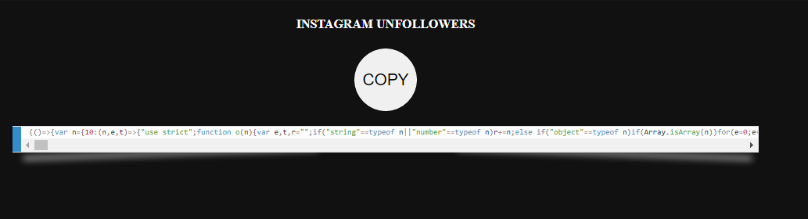
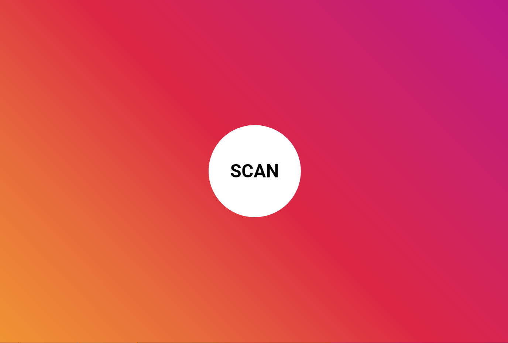
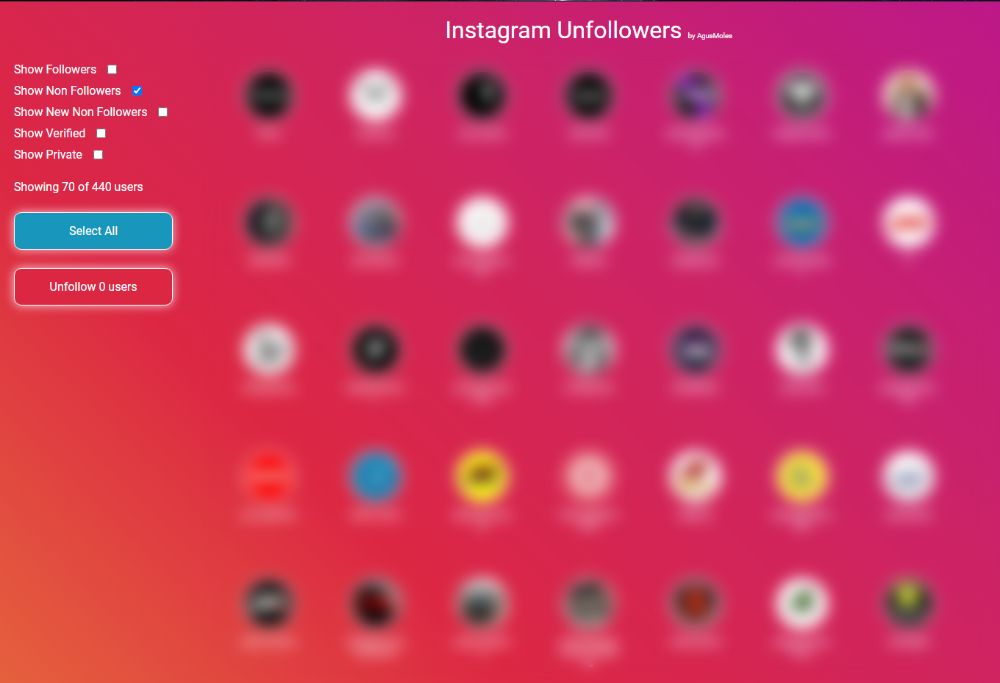

# Instagram Unfollowers

A nifty tool that lets you see who doesn't follow you back on Instagram.  
Browser-based and requires no downloads or installations!

## **WARNING**

This version utilizes the Instagram API for better performance.  

## Usage

### Steps:

1.  Copy the following code from this url. (This has been moved to this site, because the repository was taking too long to load with so many characters.The web site only shows the compiled and minified code. )

### 

2. Press the COPY button to copy the code.

    

3. Once you have copied the code, you can close this page and go to the [instagram](https://www.instagram.com/) website
4. Log in into your account and open the developer console or (Ctrl+Shift+J(Windows) || ⌘+⌥+I (Mac os)), paste the code and press enter.

5. You will be met with the following interface:

 

6. Click "SCAN" to start scanning for users who do not follow you back.
7. Once it finishes printing the users, you will be met with the following screen which will show you the results:

 

8. If you wish to un-follow any of these users, you can select 1 or more of them by clicking each user image.

## DEV

When introducing new changes to `main.tsx`, make sure to run the "build" command in-order to automatically format, compress, and convert your code. (In the future will be automatic).

## Legal

**Disclaimer:** This is not affiliated, associated, authorized, endorsed by, or in any way officially connected with Instagram.

Use it at your own risk!.